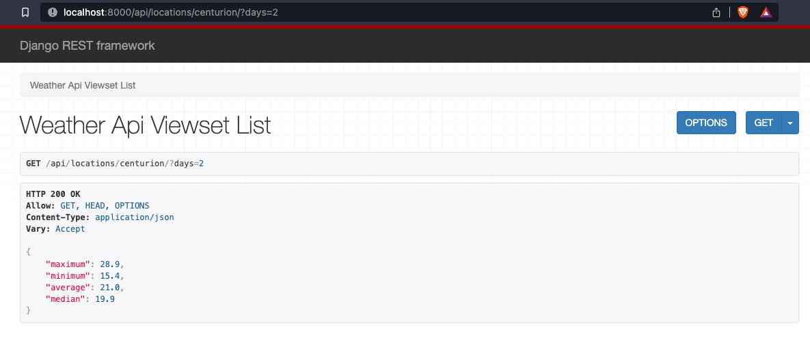

### Weather API ###

This API fetches city temperature information from [weatherapi.com](https://weatherapi.com).


### Setup ###

**Using docker:**

```make build dup```

**Manual Setup:**
- Configure a virtual environment using tools such as `pyenv` or `virtualenvwrapper` which runs `python 3.11`
- Once activated, run `pip install -r requirements.txt`
- Run the `run_dev.sh` script

**Accessing the API**
- Navigate to http://localhost:8000 in your browser (ensure that no other applications are running on this port)


**Accessing Weather Information**


- Send a GET request to http://localhost:8000/api/location/<city>/?days=<number_of_days> where `city` is the name of a city and `number_of_days` is the amount of days you wish to view the forecast for.


**Tests**
- Using docker: `make test`
- Manual setup: `python manage.py test`


**Dependancies**
- A valid [weatherapi.com](https://weatherapi.com) API key


